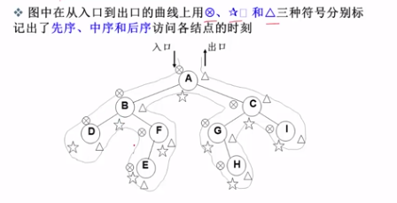

# 基础算法及数据结构学习

## 算法

---

### 二分搜索 Binary Search

1. [二分搜索策略](algorithm/BinarySearch.py)
2. [递归二分搜索策略](algorithm/RecursionBinarySearch.py)

### 分治 Divide Conquer

### 宽度优先搜索 Breadth Frist Search

### 广度优先搜索 Depth First Search

### 回溯法 Backtracking

### 双指针 Two Pointers

### 动态规划 Dynamic Programming

### 扫描线 Sacn-line algorithm

### 快排 Quick Sort

1. [冒泡排序](algorithm/BubbleSort.py)

---
---

## 数据结构

---

### 一、栈和队列 Stack && Queue

1. [栈](data_structure/栈.py)
    - 结构图   
    
2. [队列](data_structure/队列.py)
    - 结构图   
    
3. [双端队列](data_structure/双端队列.py)
    - 结构图   
    

### 二、 链表 Linked List

1. [单链表](data_structure/单链表.py)
    - 结构图   
    
2. [单项循环链表](data_structure/单项循环链表.py)
    - 结构图   
    
3. [双向链表](data_structure/双向链表.py)
    - 结构图   
    

### 三、 树
1. [基础定义及相关性质内容](data_structure/doc/树.md)
    - 结构图
    
    - 另外可以参考浙江大学数据结构课程中关于遍历方式的图，讲的十分详细
    
3. [使用链表实现二叉树的存储](data_structure/二叉树.py)
4. 二叉查找树
    - 非空左子树的所有键值小于根节点的键值
    - 非空右子树的所有键值大于根节点的键值
    - 左右子树都是二叉查找树

### 四、 数组 Array

### 五、 哈希表 Hash Table

### 六、 二叉树 Binary Tree

### 七、 堆 Heap

### 并查集 Union Find

### 字典树
