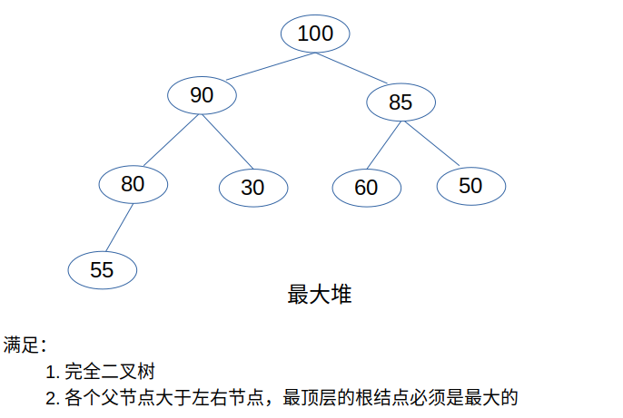

## 数据结构部分

---

### 一、栈和队列 Stack && Queue

1. [栈](data_structure/栈.py)
    - 结构图   
    
2. [队列](data_structure/队列.py)
    - 结构图   
    
3. [双端队列](data_structure/双端队列.py)
    - 结构图   
    

### 二、 链表 Linked List

1. [单链表](data_structure/单链表.py)
    - 结构图   
    
2. [单项循环链表](data_structure/单项循环链表.py)
    - 结构图   
    
3. [双向链表](data_structure/双向链表.py)
    - 结构图   
    

### 三、 树
1. [基础定义及相关性质内容](data_structure/doc/树.md)
    - 结构图
    
    - 另外可以参考浙江大学数据结构课程中关于遍历方式的图，讲的十分详细
    
2. [使用链表实现二叉树](data_structure/二叉树.py)   

3. 二叉查找树
    - 非空左子树的所有键值小于根节点的键值
    - 非空右子树的所有键值大于根节点的键值
    - 左右子树都是二叉查找树
4. 补充
    - 完全二叉树
        - 如果二叉树中除去最后一层节点为满二叉树，且最后一层的结点依次从左到右分布，则此二叉树被称为完全二叉树。
    - 满二叉树
        - 如果二叉树中除了叶子结点，每个结点的度都为 2，则此二叉树称为满二叉树。

### 四、 堆 Heap
1. 堆满足的条件
    - 必须是完全二叉树
    - 各个父节点必须大于或者小于左右节点，其中最顶层的根结点必须是最大或者最小的

2. 实现方式及条件
    - 使用数组实现二叉堆，例如下图的最大堆，在数组中使用[0,100,90,85,80,30,60,50,55]存储,注意上述第一个元素0仅仅是做占位;
    - 设节点位置为x，则左节点位置为2x，右节点在2x+1；已知叶子节点x，根节点为x//2;
    - 举例说明：
        - 100为根节点(位置为1)，则左节点位置为2，即90，右节点位置为3，即85；
        - 30为子节点(位置为5),则根节点为（5//2=2）,即90；

3. 根据上述条件，我们可以绘制出堆的两种形式   
   
    - [最大堆及实现](data_structure/最大堆.py)  
    
       
    - [最小堆及实现](data_structure/最小堆.py)      
    

### 五、图 Graph
1. 图的实现方法
    - 简易图结构   
        
    - [邻接矩阵（无向图）](data_structure/邻接矩阵实现无向图.py)   
        
    - [邻接列表（有向图）](data_structure/邻接列表实现有向图.py)   
        

<!-- ### 六、 哈希表 Hash Table

### 七、 数组 Array

### 八、 并查集 Union Find -->

## 算法部分

---

### 一、排序算法

1. [冒泡排序](algorithm/冒泡排序.py)

    冒泡冒泡，是将石头丢下去，才会有个泡泡冒起来，顾名思义，我们创建一个for循环，从后往前遍历，这样就实现了每次遍历都会剔除掉最后一个元素的操作，这恰好是我们所需要的（因为冒泡排序的内循环就是将最大元素移动到最后的位置）   
    在内循环中，我们从头开始遍历，每一次都会比较当前点和下一个点比较，满足条件就交换，一直循环下去，这样就会在一轮循环中将一个最大的元素移动到最后，此时我们执行外循环，进行新一轮的大元素的后移操作。

2. [选择排序](algorithm/选择排序.py)

    选着排序中假设for循环为游标移动，就相当于两个快慢性格的人，慢游标移动一格，快游标则是在当前漫游标的位置开始向右移动，一直到末尾；此时漫游标再右移动一格，快游标再次重复上述操作。
    在快游标移动过程中，它需要做比较操作，若是比漫游标位置处的 元素要小，则记录一下，然后再右移，若是再遇到一个元素比在途中遇到的还小，则重新记录一下，最终快游标一一循环走完，跳出循环时，需要做一下小小的判断，若是记录的最小元素的索引比初始的要小，则交换一下位置，否则不做操作。

3. [插入排序](algorithm/插入排序.py)
 
    相当于创建两个游标，第一个游标一直向前走，不回头的那种，而第二个游标则是获取第一个游标的位置之后往回走。   
    当第一个游标向右移动一格，此时我们就开始将当前游标下的元素和前一个元素比较，在相应条件（小于或者大于）下进行交换操作，一直到第二个游标完全逆向遍历完，跳出循环，此时第一个游标向右再走一格，然后第二个游标往回走...
    这里说一个小技巧，就是第二个游标在往回遍历时，若是已经遍历到超出我们设置的条件时，可以做break操作，原因是之前的数其实就是升序或者降序，效果就是可以节省时间。
 
4. [快速排序](algorithm/快速排序.py)   

    从数列中挑选一个元素，我们称之为“基准”（这里我们选择最后一个元素），然后创建两个游标，分别在数列头部和数列尾部-1的位置，前游标向后移动（保证游标大小不可以大于后游标），遇到的元素大于尾部元素，则暂停！此时后游标向前移动（保证游标大小不可以小于前游标），遇到的元素小于尾部元素则暂停，然后交换两个游标指向的元素；然后再去处理游标的移动，若是前游标小于后游标，这继续移动，一直到两个游标重合，此时和最后的元素相比较，然后交换。此时就会实现一个数列的分割，变为左右两个部分，使用递归的方法对余下部分进行处理即可。

5. [希尔排序](algorithm/希尔排序.py)   

    可以简单理解为插入排序的变种,是将整个有序序列分割成若干小的子序列分别进行插入排序。

6. [归并排序](algorithm/归并排序.py)   

    归并排序是将原数列分成若干个小份,对每小份进行排序,然后合并的过程。

7. [堆排序](algorithm/堆排序.py)   

    利用最小堆（最大堆）的原理实现排序，具体可以参考数据结构部分中有关最小堆（最大堆）的介绍。

### 二、查找算法

1. 二分搜索 Binary Search
    
    - [二分搜索策略](algorithm)
         - [Python实现](algorithm/BinarySearch.py)
         - [C++实现](algorithm/BinarySearch.cpp)
         
    - [递归二分搜索策略](algorithm/RecursionBinarySearch.py)
         - [Python实现](algorithm/RecursionBinarySearch.py)
         - [C++实现](algorithm/RecursionBinarySearch.cpp)
     
<!-- ### 分治 Divide Conquer

### 宽度优先搜索 Breadth Frist Search

### 广度优先搜索 Depth First Search

### 回溯法 Backtracking

### 双指针 Two Pointers

### 动态规划 Dynamic Programming

### 扫描线 Sacn-line algorithm -->

