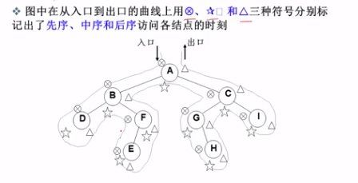

1. 定义及相关术语
- 定义
    ```
    - 子树不相交；
    - 抛开根节点，每个节点有且仅有一个父节点；
    - 一棵N个节点的树有N-1条边。
    ```
- 相关术语
    ```
    - 节点的度：一个节点含有的子树的个数称为该节点的度；
    - 树的度：一颗树中，最大的节点的度称为树的度；
    - 叶节点或终端节点：度为零的节点；
    - 父节点：若一个节点含有子节点，则这个节点称为其子节点的父节点；
    - 子节点：一个节点含有的子树的根节点称为该节点的子节点；
    - 兄弟节点：具有相同父节点的节点互相称为兄弟节点；
    - 节点的层次：从根节点开始定义起，根为第一层，根的子节点为第二层，以此类推；
    - 树的高度或深度：树中节点的最大层次；
    - 堂兄弟节点：父节点在同一层次的节点互为堂兄弟；
    - 节点的祖先：从根节点到该节点所经分支上的所有节点；
    - 子孙：以某一节点为根的子树中任一节点都称为该节点的子孙；
    - 森林：由m（m >= 0）颗互不相交的树的集合称为森林；
    ```
2. 重要性质
    ```
    - 一个二叉树第i层的最大节点数为2^(k-1),k>=1;
    - 深度为k的二叉树有最大节点总数为2^k-1,k>=1;
    - 对于一个非空二叉树，n0表示叶子节点的个数，n2表示度为2的非叶节点的个数，则n0=n2+1;
    ```
3. 常用遍历方法
    ```
    - 先序遍历
        - 根、左子树、右子树；
    - 中序遍历
        - 左子树、根、右子树；
    - 后序遍历
        - 左子树、右子树、根；
    - 层次遍历
        - 从上到下、从左到右；
    ```
    - 浙江大学数据结构课程中关于遍历方式的图，讲的十分详细
    